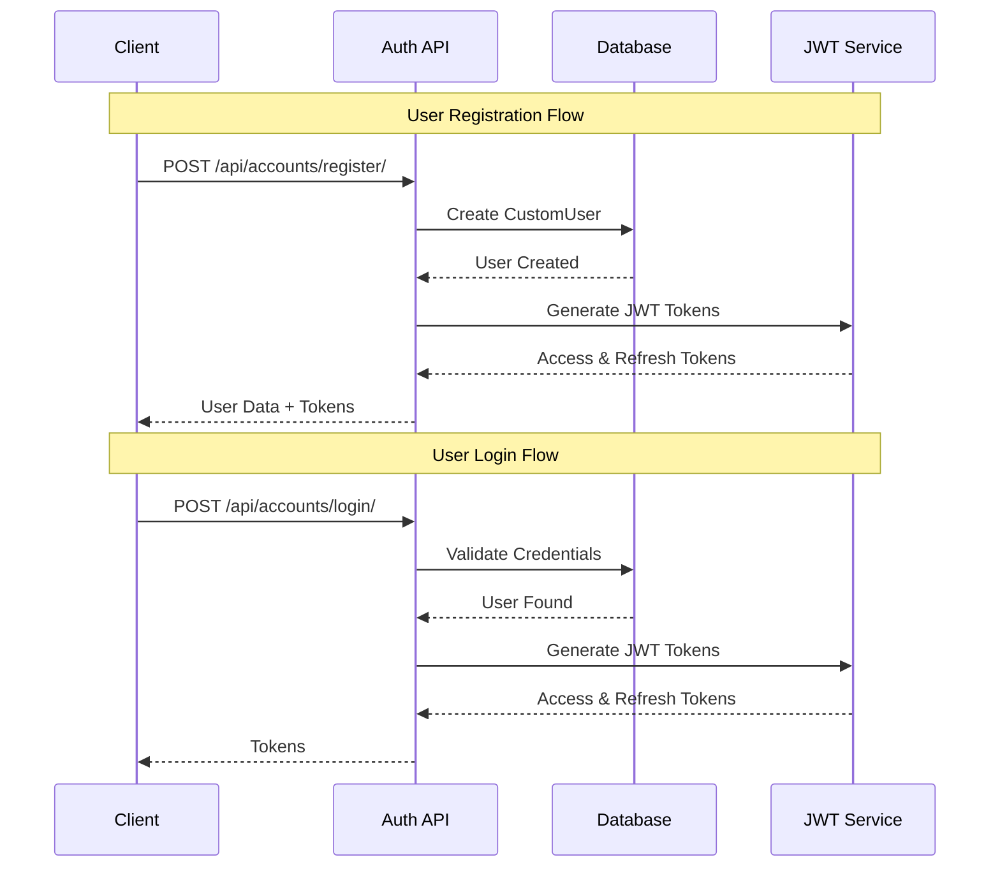
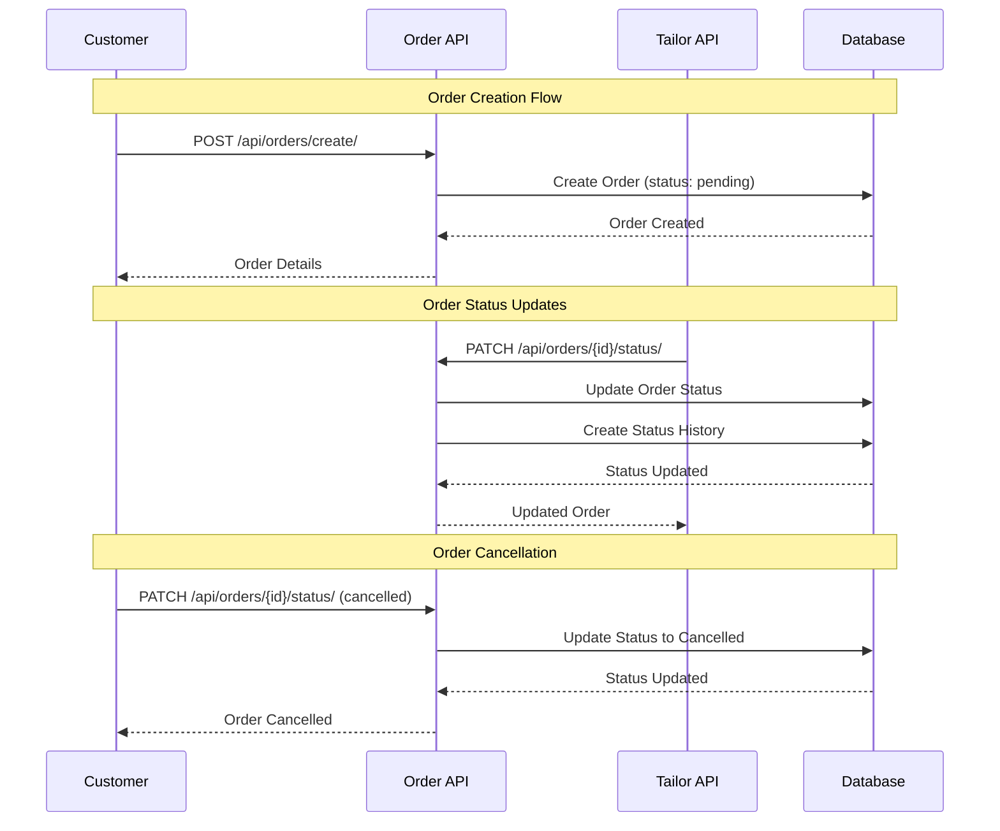
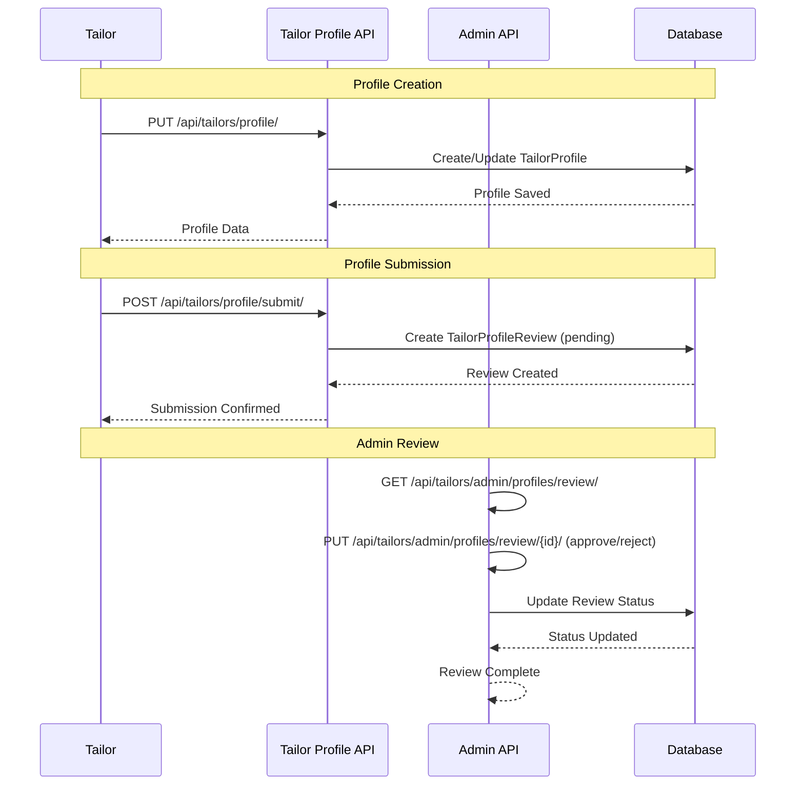
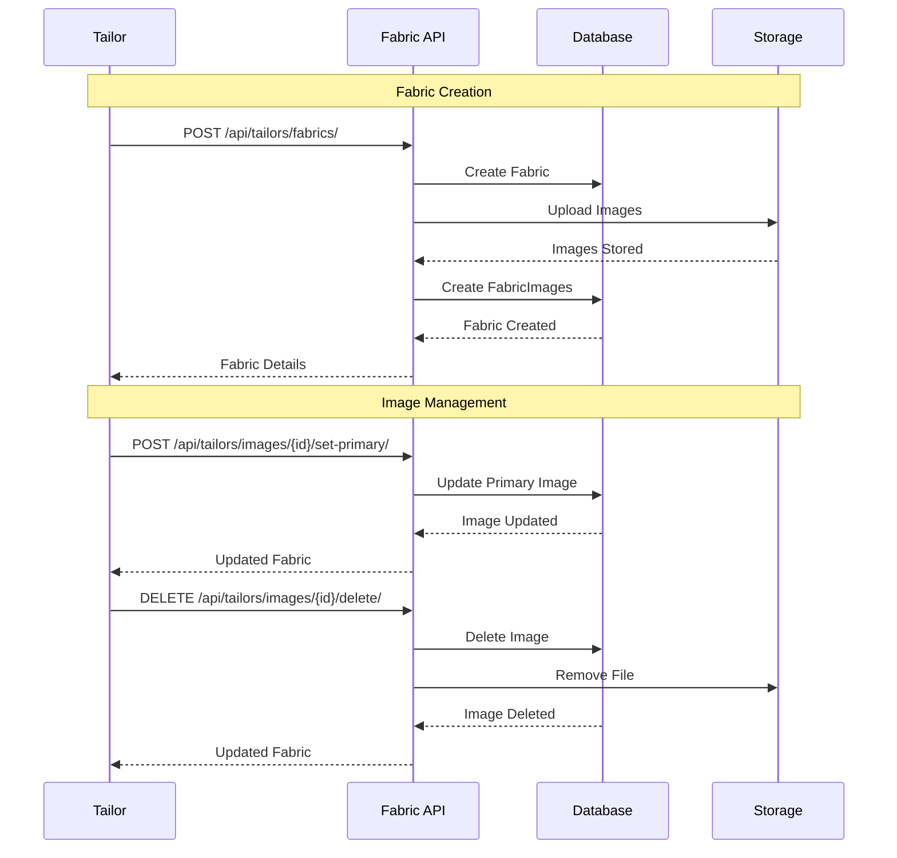
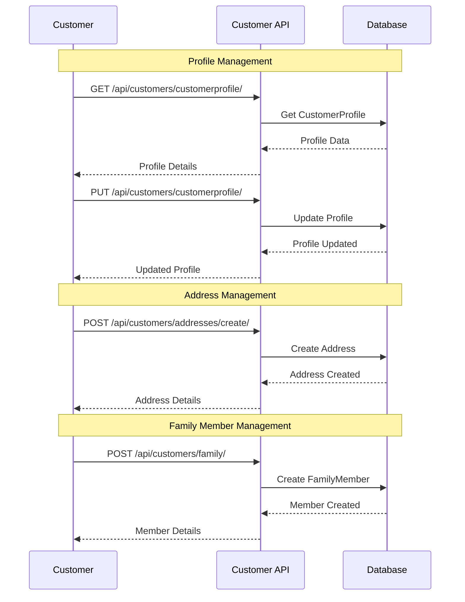
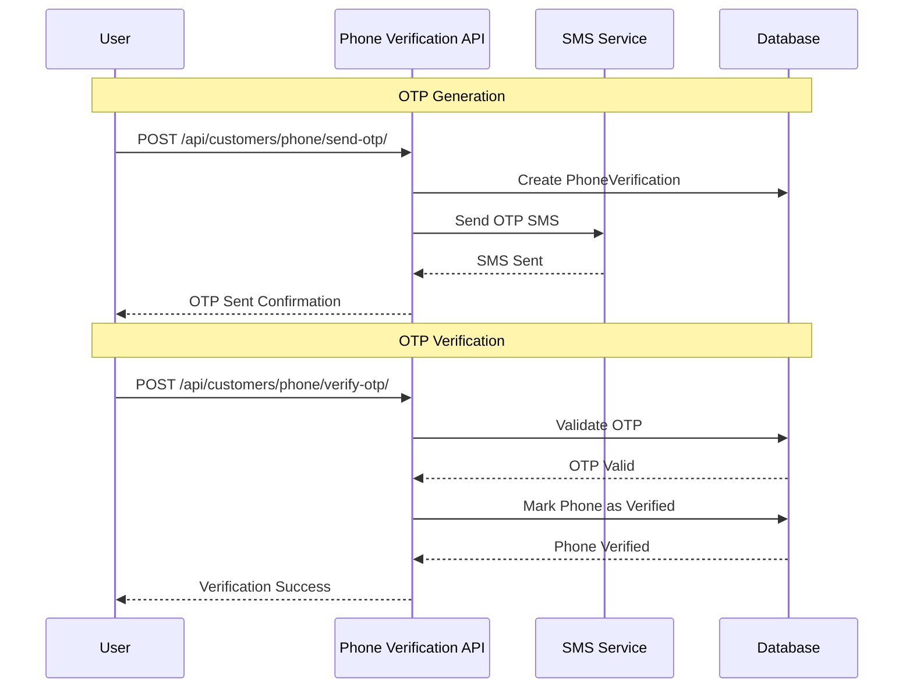
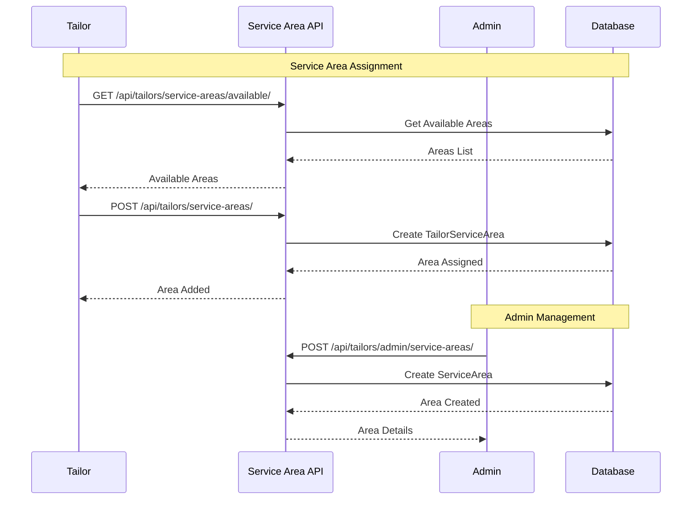
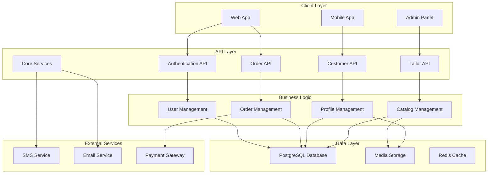
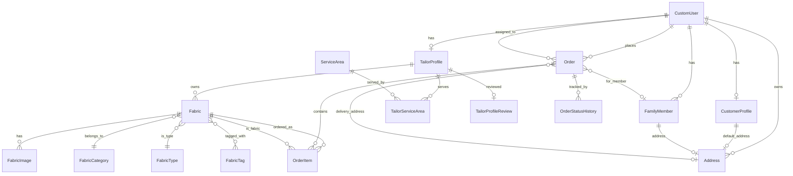

# API Flow Diagrams - Zthob Backend

## 1. User Registration & Authentication Flow



## 2. Order Creation & Management Flow



## 3. Tailor Profile & Review Flow



## 4. Fabric Management Flow



## 5. Customer Management Flow



## 6. Phone Verification Flow



## 7. Service Area Management Flow



## 8. Order Status Flow Diagram

```mermaid
stateDiagram-v2
    [*] --> pending: Order Created

    state "Fabric Only Flow" as FO
    state "Fabric with Stitching Flow" as FWS

    pending --> confirmed: Tailor Confirms
    pending --> cancelled: Customer Cancels

    confirmed --> FO: Fabric Only Order
    confirmed --> FWS: Stitching Order

    state FO {
        confirmed --> ready_for_delivery: Ready
        ready_for_delivery --> delivered: Delivered
    }

    state FWS {
        confirmed --> measuring: Take Measurements
        measuring --> cutting: Cut Fabric
        cutting --> stitching: Sew Garment
        stitching --> ready_for_delivery: Ready
        ready_for_delivery --> delivered: Delivered
    }

    delivered --> [*]
    cancelled --> [*]

    note right of pending
        Only customers can cancel
        Only when status is pending
    end note

    note right of confirmed
        Tailors can update status
        Customers cannot cancel
    end note
```

## 9. System Architecture Overview



## 10. Database Entity Relationship



## API Response Format

All APIs follow a consistent response format:

```json
{
    "success": true,
    "message": "Operation completed successfully",
    "data": {
        // Response data here
    },
    "errors": null
}
```

## Error Response Format

```json
{
    "success": false,
    "message": "Operation failed",
    "data": null,
    "errors": {
        "field_name": ["Error message"]
    }
}
```

## Authentication

All protected endpoints require JWT authentication:

```
Authorization: Bearer <access_token>
```

## Rate Limiting

- Phone verification: 5 requests per hour per user
- Login attempts: 10 attempts per hour per IP
- API calls: 1000 requests per hour per user

## File Upload

- Supported formats: JPG, JPEG, PNG
- Maximum file size: 10MB
- Multiple images supported for fabrics
- Primary image designation system
