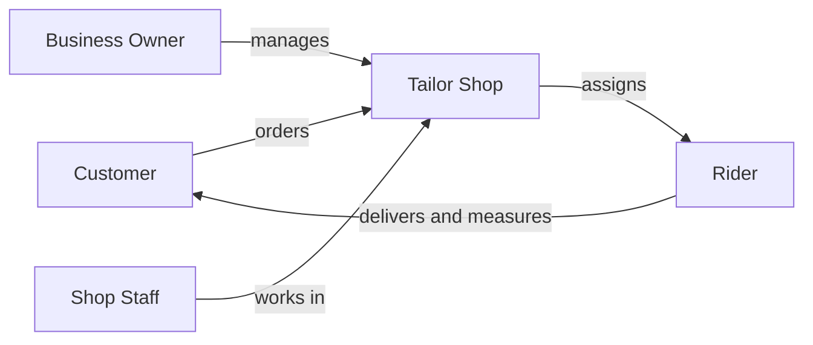

# Chapter 2 — Who Uses Mgask

Mgask serves five types of users. Each has their own app experience and responsibilities.

## User roles at a glance

| Role | Description | App |
|------|-------------|-----|
| **Customer** | Buys fabrics, orders stitching, pays online, tracks delivery | Customer App |
| **Solo Tailor** | Runs one tailor shop — orders, fabrics, staff, in-store sales | Tailor App |
| **Business Owner** | Owns one or more tailor branches; manages shops and staff centrally | Tailor App (Owner mode) |
| **Shop Staff** | Works inside a shop with permissions set by the owner | Tailor App (Staff mode) |
| **Rider** | Delivers orders and takes home measurements for tailor teams | Rider App |

## Customer

The end user of the platform. Customers can:

- Discover tailor shops and browse fabric catalogs
- Choose thobe styles (collar, cuff, pocket, and more)
- Place orders for fabric only, fabric + stitching, or stitching only
- Request a home measurement visit
- Pay by card or cash on delivery
- Track their order and rate the tailor after completion

## Solo tailor

A tailor who operates a single shop. They use the Tailor App to:

- Set up and manage their shop profile
- List fabrics and set prices
- Accept and process customer orders
- Record measurements in the shop
- Use the in-store counter (POS) for walk-in customers
- Add employees and control what each person can do

## Business owner

An owner who runs **multiple tailor branches** under one company. In addition to everything a solo tailor can do, owners can:

- Create a business profile and add multiple shop locations
- Manage a staff roster and assign people to specific branches
- View reports across all shops
- Switch into any shop to work on daily orders

## Shop staff

Employees hired by a tailor or owner. Staff log into the same Tailor App but only see the shops they are assigned to. The owner decides what each staff member can do — for example, managing orders, updating the fabric catalog, or using the shop counter.

## Rider

Couriers who work with tailor shops to:

- Pick up finished orders from the tailor and deliver them to the customer
- Visit customers at home to take body measurements
- Join a tailor's team through an invitation code from the shop

Riders must be verified by Mgask before they can accept jobs.

