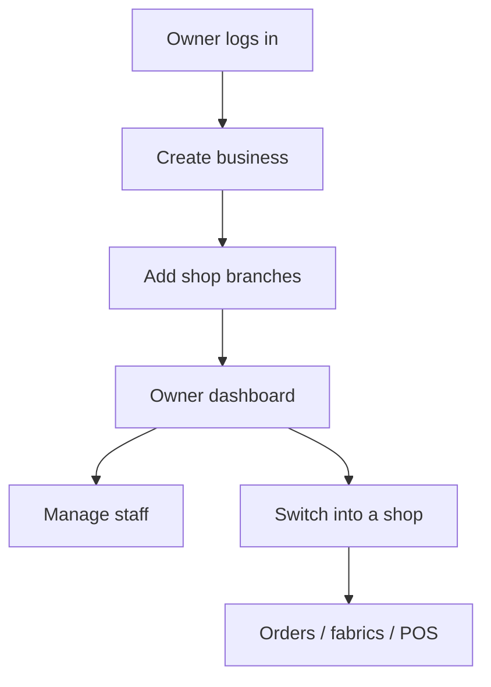

# Chapter 4 — Tailor and Owner App

The Tailor App is the daily workspace for tailor shops. One app supports three modes depending on who is logging in.

## App modes

| Mode | Who | First-time setup |
|------|-----|------------------|
| **Solo Tailor** | Single-shop operator | Register shop profile |
| **Owner** | Multi-branch business owner | Create business, then add shops |
| **Staff** | Shop employee | Assigned by owner; pick shop on login |

All modes use phone number + OTP to sign in. Returning users are recognised automatically.

## Shop profile

Every shop has a public profile that customers see:

- Shop name, logo, photos, and description
- Opening hours and location
- Express delivery option (faster turnaround for an extra fee)
- Home measurement fee (if the shop offers measurement visits)
- Customer ratings from completed orders

The tailor can **open or close** the shop — when closed, new online orders are not accepted.

## Fabric catalog

| Feature | Description |
|---------|-------------|
| Add fabrics | Name, photos, price, stitching price, categories and tags |
| Manage stock | Track availability per shop |
| Business catalog (owners) | Create products once and assign them to multiple branches |

Fabrics go through Mgask approval before appearing to customers (quality control).

## Order management

- View new, active, and completed orders
- Accept or decline incoming orders
- Update order progress as work moves through the shop
- Record customer measurements on the order
- Download a **work-order document** (PDF) for the production team
- Assign stitching work to a specific employee

## In-store sales (POS)

For customers who visit the shop in person:

- Search for an existing customer or create a new one on the spot
- Add family members and measurements at the counter
- Place walk-in orders (cash stays at the shop)
- View a customer's previous orders at your shop

## Owner dashboard (multi-branch)

Business owners get an additional management layer:

- Create and manage multiple shop branches
- Pin favourite shops for quick access
- Maintain a staff roster and assign people to specific shops
- View cross-shop reports and analytics
- **Switch into a shop** to work on orders, fabrics, and POS — same tools as a solo tailor

## Rider team

Tailors can build their own delivery team:

- Generate an **invitation code** for riders
- Riders join the team by entering the code in the Rider App
- The tailor chooses whether each rider can take measurements, do deliveries, or both

## Analytics and ratings

- View order summaries, express orders, and sales trends
- Read customer ratings and feedback after completed orders
