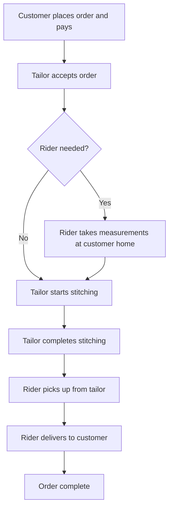

# Chapter 6 — How Orders Work

This chapter explains the order journey in simple terms — from the moment a customer places an order to when it is completed.

## Order types recap

| Type | What happens |
|------|--------------|
| Fabric only | Customer buys fabric; may be delivered or collected in shop |
| Fabric + stitching | Customer buys fabric and gets a thobe stitched |
| Stitching only | Customer provides fabric; tailor stitches it |
| Home measurement | A rider or tailor visits to take measurements only |

## Service modes

| Mode | Description |
|------|-------------|
| **Home delivery** | A rider picks up from the tailor (or takes measurements at the customer's home) and delivers the finished order to the customer |
| **Walk-in (in shop)** | Customer visits the tailor; no rider involved; customer collects the finished order from the shop |

## The order journey (home delivery with stitching)

## Step by step

### 1. Customer places the order

The customer selects fabrics, styles, and measurements (or requests a home measurement visit), reviews the price, and pays online or chooses cash on delivery.

### 2. Tailor accepts

The tailor shop reviews the order and accepts it. If the shop is closed or unavailable, new orders are not accepted.

### 3. Measurements (if needed)

- **Home delivery:** A rider may visit the customer to take measurements before stitching begins
- **Walk-in:** The tailor records measurements in the shop
- If the customer already provided measurements when ordering, this step may be skipped

### 4. Tailoring

The tailor (or assigned stitcher) works on the order. Progress is updated in the app so the customer can follow along.

### 5. Ready for delivery or pickup

- **Home delivery:** When stitching is done, the order is ready for the rider to pick up
- **Walk-in:** The customer is notified that the order is ready to collect from the shop

### 6. Delivery or collection

- **Home delivery:** The rider delivers to the customer's address; the customer can track the rider on a map
- **Walk-in:** The customer visits the shop and collects the order

### 7. Order complete

The order is marked complete. The customer can rate the tailor. Tailor and rider earnings are recorded according to platform rules.

## Cancellation

Customers can cancel an order while it is still waiting for the tailor to accept. After acceptance, cancellation follows the shop's policy and platform rules.

## Express delivery

Some shops offer **express delivery** — faster turnaround for an additional fee. The customer sees this option during checkout if the shop has it enabled.
