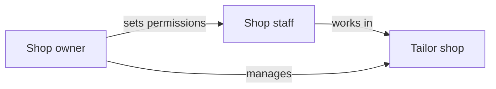

# Chapter 8 — Staff and Access

Tailor shops often have more than one person working behind the counter, in production, or at reception. Mgask lets owners control **who can do what** inside each shop.

## Owner vs staff

| | Business owner / shop owner | Shop staff |
|---|---------------------------|------------|
| **Scope** | Full control of their business and shops | Limited to assigned shop(s) |
| **Setup** | Creates business, shops, and staff accounts | Invited by owner; logs in with own phone |
| **Permissions** | Can do everything | Only what the owner allows |
| **Multi-shop** | Yes — manage all branches | Only shops they are assigned to |

## What owners can control

When adding or editing a staff member, the owner chooses which areas that person can access:

| Area | Examples of what staff can do when allowed |
|------|---------------------------------------------|
| **Orders** | Accept orders, update progress, record measurements, print work orders |
| **Fabric catalog** | Add, edit, and remove fabrics and photos |
| **Shop counter (POS)** | Create customers, place walk-in orders, manage family members |
| **Analytics** | View sales and order reports |
| **Staff management** | Add or remove other employees (usually managers only) |
| **Shop profile** | Edit shop name, hours, logo, and details |
| **Shop open/close** | Turn the shop online or offline for new orders |
| **Shop address** | Update the shop location |
| **Stitching** | Work on assigned stitching orders in the production queue |

Staff without a permission simply will not see or be able to use that part of the app.

## Staff job titles

In addition to permissions, each employee can have a job title for organisation:

- Manager
- Stitcher
- Cutter
- Receptionist
- Finisher

The title is for clarity; **access is controlled by permissions**, not by the title alone.

## Assigning staff to multiple shops

A business owner with several branches can:

- Add one person to the staff roster once
- Assign them to one or more shops
- Give **different permissions per shop** (e.g. orders in Shop A, POS only in Shop B)

## Staff daily experience

1. Staff opens the Tailor App and signs in with their phone
2. If assigned to multiple shops, they select which shop to work in
3. The app shows only the features their permissions allow
4. They work on orders, fabrics, or POS as authorised by the owner

