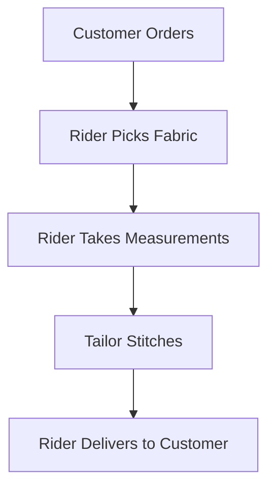
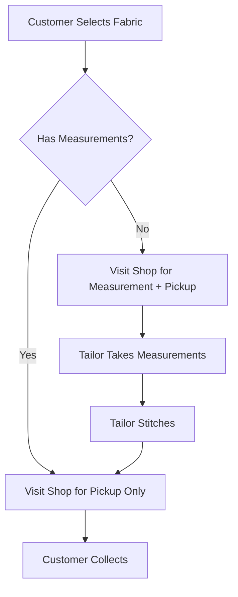

# Walk-In Mode Feature - Planning Document

## 📋 Overview

**Feature Name:** Walk-In Service Mode (No Rider Involvement)

**Purpose:** Allow customers to visit tailor shops directly for measurements and/or fabric pickup, eliminating rider involvement entirely.

**Business Value:**
- Reduces operational costs (no rider fees)
- Provides flexibility to customers who prefer direct interaction
- Faster turnaround for local customers
- Builds stronger customer-tailor relationships

---

## 🔄 User Flow Comparison

### Current Flow (With Rider)


### New Flow (Walk-In Mode)


---

## 🎯 Feature Requirements

### 1. Frontend (Flutter) Requirements

#### Order Creation Screen
- [ ] Add toggle/option: **"Walk-In Mode"** vs **"Home Delivery"**
- [ ] If Walk-In selected:
  - [ ] Hide delivery address fields
  - [ ] Show tailor shop address/location
  - [ ] Add option: "I will provide measurements at shop" checkbox
  - [ ] If measurements available, allow customer to input them

#### Tailor Shop Selection
- [ ] Show nearby tailor shops with:
  - [ ] Shop name
  - [ ] Address
  - [ ] Distance from customer
  - [ ] Working hours
  - [ ] Map integration

#### Order Summary
- [ ] Display pickup instructions
- [ ] Show estimated ready date
- [ ] No delivery fee displayed

---

### 2. Backend Requirements

#### Database Changes

**Order Model - New Fields:**
```python
# Add to Order model
service_mode = models.CharField(
    max_length=20,
    choices=[
        ('home_delivery', 'Home Delivery'),
        ('walk_in', 'Walk-In Service')
    ],
    default='home_delivery'
)

# Make these nullable for walk-in orders
rider = models.ForeignKey(nullable=True)  # Already exists
delivery_address = models.CharField(null=True, blank=True)

# Add pickup information
pickup_ready_date = models.DateField(null=True, blank=True)
pickup_notification_sent = models.BooleanField(default=False)
```

#### Status Flow Changes

**Walk-In Order Statuses:**
```
pending → confirmed → in_progress → ready_for_pickup → collected
```

**New Status Choices:**
- `ready_for_pickup` - When tailor finishes stitching
- `collected` - When customer picks up from shop

**Status Mappings:**
| Status | Rider Status | Tailor Status |
|--------|--------------|---------------|
| pending | `none` (N/A) | `none` |
| confirmed | `none` (N/A) | `accepted` |
| in_progress | `none` (N/A) | `stitching_started` |
| ready_for_pickup | `none` (N/A) | `stitched` |
| collected | `none` (N/A) | `stitched` |

---

### 3. Business Logic Changes

#### Order Calculation Service

**Pricing for Walk-In Orders:**
```python
# No delivery fee for walk-in orders
if order.service_mode == 'walk_in':
    delivery_fee = Decimal('0.00')
```

#### Order Status Transition Service

**New Transition Rules:**
```python
def _get_walk_in_transitions(order, user_role):
    """Get transitions for walk-in orders"""
    
    if user_role == 'TAILOR':
        if order.status == 'pending':
            return ['confirmed']  # Accept order
        elif order.status == 'confirmed':
            return ['in_progress']  # Start work
        elif order.status == 'in_progress':
            return ['ready_for_pickup']  # Finish stitching
    
    elif user_role == 'USER':
        if order.status == 'ready_for_pickup':
            return ['collected']  # Mark as picked up
        elif order.status == 'pending':
            return ['cancelled']
    
    return []
```

---

### 4. Measurement Handling

#### Scenario A: Customer Has Measurements
```
1. Customer inputs measurements during order creation
2. Order goes directly to tailor
3. Tailor starts stitching
4. Customer visits shop only for pickup
```

#### Scenario B: Customer Needs Measurements
```
1. Customer selects "Take measurements at shop"
2. Customer visits shop at any time before stitching starts
3. Tailor takes measurements and updates order
4. Tailor starts stitching
5. Customer returns for pickup when notified
```

**Database Fields for Measurements:**
```python
# Already exists in your system (OrderItem model)
# Just ensure these work for walk-in mode too
measurements_taken_at_shop = models.BooleanField(default=False)
measurement_date = models.DateTimeField(null=True, blank=True)
```

---

### 5. Notification Strategy

#### Customer Notifications
- Order confirmed by tailor
- Reminder to visit shop for measurements (if needed)
- Stitching started
- **Order ready for pickup** (most important!)
- Pickup reminder (if not collected after 2-3 days)

#### Tailor Notifications
- New walk-in order received
- Customer visited shop for measurements
- Payment received (if applicable)

---

## 🚀 Implementation Phases

### **Phase 1: Database & Basic Flow** (Day 1-2)
- [ ] Add `service_mode` field to Order model
- [ ] Create migration
- [ ] Update Order serializers to handle walk-in mode
- [ ] Add validation logic (no rider required, no delivery address)

### **Phase 2: Status Management** (Day 3-4)
- [ ] Add new statuses: `ready_for_pickup`, `collected`
- [ ] Update OrderStatusTransitionService for walk-in flow
- [ ] Add FSM transitions for walk-in orders
- [ ] Write tests for walk-in status transitions

### **Phase 3: Business Logic** (Day 5-6)
- [ ] Update OrderCalculationService (zero delivery fee)
- [ ] Handle measurement scenarios (with/without measurements)
- [ ] Add tailor shop selection logic
- [ ] Update order creation API endpoint

### **Phase 4: Notifications** (Day 7)
- [ ] Create "ready for pickup" notification templates
- [ ] Add measurement reminder notifications
- [ ] Implement pickup overdue reminders

### **Phase 5: Flutter Frontend** (Day 8-10)
- [ ] Add Walk-In toggle on order creation screen
- [ ] Build tailor shop selection UI
- [ ] Integrate measurements input (optional)
- [ ] Update order tracking screen for walk-in orders

### **Phase 6: Testing & Refinement** (Day 11-12)
- [ ] End-to-end testing
- [ ] Edge case handling
- [ ] Performance optimization
- [ ] Bug fixes

---

## 🎯 API Endpoint Changes

### Order Creation Endpoint
```python
POST /api/orders/

# Request Body
{
    "service_mode": "walk_in",  # NEW FIELD
    "tailor": 123,
    "order_type": "fabric_with_stitching",
    "items": [...],
    "has_measurements": false,  # NEW FIELD
    "measurements": null,  # Optional
    # No delivery_address required
    # No delivery_lat/lng required
}

# Response includes:
{
    "id": 456,
    "service_mode": "walk_in",
    "tailor_shop": {
        "name": "Ahmad Tailors",
        "address": "Shop 12, Market Street",
        "phone": "+92123456789",
        "working_hours": "9 AM - 9 PM"
    },
    "delivery_fee": "0.00",  # Always 0 for walk-in
    ...
}
```

### New Endpoint: Mark as Collected
```python
POST /api/orders/{id}/collect/

# Only customer can call this
# Validates order.status == 'ready_for_pickup'
# Updates to 'collected'
```

---

## ⚠️ Important Considerations

### 1. **Validation Rules**
- Walk-in orders MUST have `rider = null`
- Walk-in orders MUST have `delivery_fee = 0`
- Walk-in orders DON'T require delivery address
- Walk-in orders MUST have a selected tailor

### 2. **Payment Handling**
- Should payment be upfront or on pickup?
- Consider partial payment (advance + balance on pickup)

### 3. **Measurement Timing**
- How long to wait for customer to visit for measurements?
- Auto-cancel if customer doesn't show up within X days?

### 4. **Shop Hours**
- Show shop working hours to customers
- Prevent orders outside working hours?

### 5. **Capacity Management**
- Limit number of walk-in orders per tailor?
- Queue management for in-person measurements?

---

## 📊 Success Metrics

Track these metrics after launch:
- % of orders using walk-in mode
- Average cost savings per walk-in order
- Customer satisfaction ratings (walk-in vs delivery)
- Pickup completion rate
- Time from order to collection

---

## 🔄 Migration Strategy

### For Existing Orders
- All existing orders default to `service_mode = 'home_delivery'`
- No changes to existing order flows

### Gradual Rollout
1. Launch to 10% of customers (A/B test)
2. Monitor metrics for 1 week
3. If successful, expand to 50%
4. Full rollout after 2 weeks

---

## 🎨 UI/UX Mockup Ideas

### Order Creation Screen
```
┌─────────────────────────────┐
│ Select Service Type         │
├─────────────────────────────┤
│ ○ Home Delivery             │
│ ● Walk-In Service           │
├─────────────────────────────┤
│ Selected Shop:              │
│ 📍 Ahmad Tailors            │
│    123 Market St, 2.3 km    │
│    [Change Shop]            │
├─────────────────────────────┤
│ ☑️ I'll provide measurements│
│    at the shop              │
└─────────────────────────────┘
```

### Order Tracking (Walk-In)
```
┌─────────────────────────────┐
│ Order #12345                │
├─────────────────────────────┤
│ Status: Ready for Pickup ✓  │
│                             │
│ 📍 Pickup Location:         │
│    Ahmad Tailors            │
│    123 Market St            │
│    [Get Directions]         │
│                             │
│ ⏰ Shop Hours:              │
│    9:00 AM - 9:00 PM        │
│                             │
│ [Mark as Collected]         │
└─────────────────────────────┘
```

---

## 🤔 Questions to Decide

1. **Measurement Window:** How many days should customers have to visit for measurements before auto-cancellation?

2. **Payment Terms:** 
   - Full payment upfront?
   - Partial payment (e.g., 50% advance)?
   - Payment on pickup?

3. **Cancellation Policy:** Can customers cancel walk-in orders after tailor starts stitching?

4. **Shop Selection:** 
   - Auto-assign nearest tailor?
   - Let customer choose from list?
   - Filter by ratings/reviews?

5. **Pickup Deadline:** Should uncollected orders be auto-archived after X days?

6. **Hybrid Mode:** Should customers be able to choose "measurements at shop + home delivery"?

---

## 📝 Next Steps

1. **Review this document** and decide on open questions above
2. **Prioritize features** - which scenarios to implement first?
3. **Create detailed task.md** breaking down implementation
4. **Start with Phase 1** - database changes and basic flow
5. **Iterate based on feedback**

